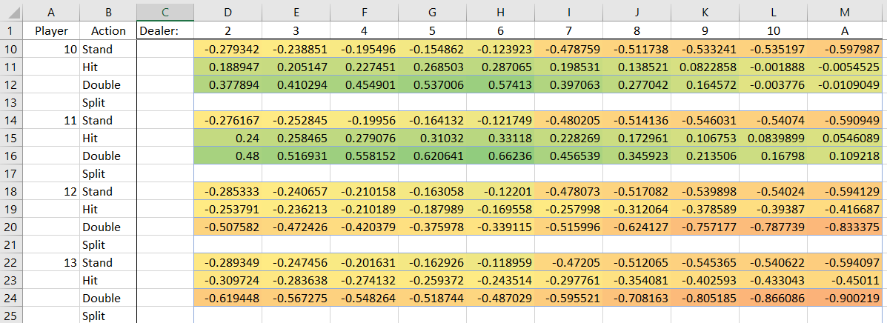

# Summary 
This is a program to attempt to devise the optimal blackjack strategy via repeated simulation. It plays a large number of hands, tracking each choice made and the resulting outcome to both deduce the optimal strategy, but also to give the relative expected values of each choice.

# Details
I wanted to write a program to find the relative outcomes of each choice in blackjack, but without computing any actual probabilites, as that's harder, and takes the fun out of it.  I was specifically curious to find what were the 'significant' choices in blackjack, where the difference between making the optimal play and the next most optimal play has the largest delta, as well as what hands you're expected to make money on.

This blackjack simulator works by continuously playing hands of blackjack, starting with no knowledge of the strategy or outcomes.  For for each possible action available, it tries all options simultaneously in, tracking the outcome of doing that action followed by playing 'optimally' from there on out.  Playing 'optimally' involved choosing the actionw with the highest expected outcome, so it's ability to play optimally improves as the simulation runs.

# Results

Here is an example table with the normalized expected value of various player hands vs. what the dealer is showing.  This table shows quite well the differences in expected value between having an 11 and a 12, and why it is so important to double down in these hands.

